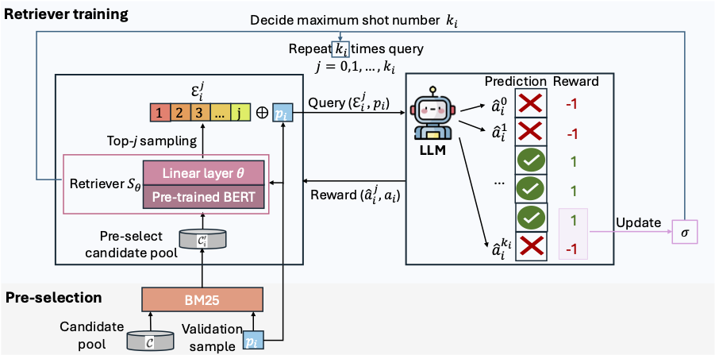

# Dynamic Uncertainty Ranking
Code for our NAACL 2025 paper [***Dynamic Uncertainty Ranking: Enhancing In-Context Learning for Long-Tail Knowledge in LLMs***](https://arxiv.org/abs/2410.23605) by Shuyang Yu, Runxue Bao, Parminder Bhatia, Taha Kass-Hout, Jiayu Zhou, Cao Xiao.

## Overview

